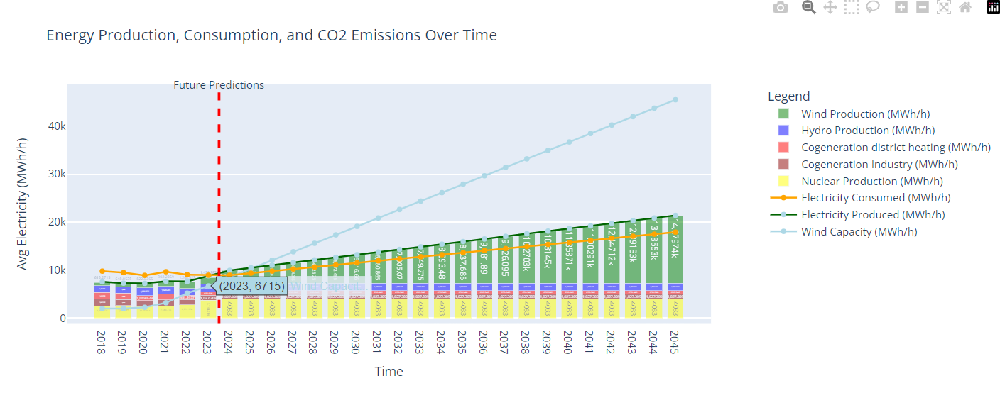

# Instructions to Download
```python
import gdown
import zipfile
url = 'https://drive.google.com/uc?id=1N4VkXWTPghEayyQSUzimW70NUgLrN-H7'
output = 'jsons.zip'
gdown.download(url, output, quiet=False)
with zipfile.ZipFile(output, 'r') as zip_ref:
    zip_ref.extractall('jsons')
os.remove("jsons.zip")
```
# Analysis
